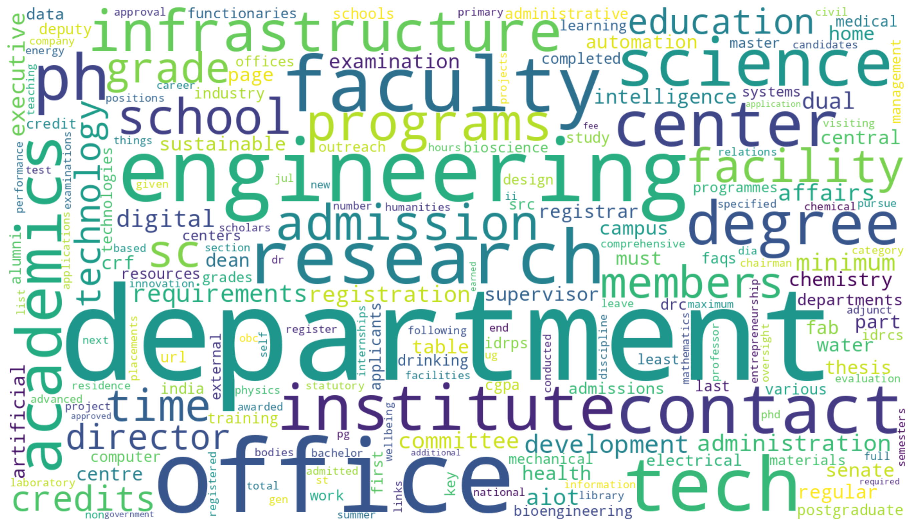

# Word Embedding and Name Generation Project

This repository contains code for: 
- Corpus collection and preprocessing
- Dataset statistics generation
- Word cloud visualization
- Word embedding experiments
- Name generation models using RNN, BiLSTM, and Attention+RNN
---


## Running the Code from Terminal

### Clone the repository & go to the right directory 
```
git clone https://github.com/Anindita1709/NLU_A2.git
cd NLU_A2\Problem #
```

### Install dependencies
```
pip install -r requirements.txt
```

### Run the code (Problem 1)
```
python data_preprocess.py
python manual_word2vec.py
```

---

## Running the Code in Google Colab

### Install dependencies
```
!pip install -r requirements.txt
```

### Run the script
```
!python data_preprocess.py
!python manual_word2vec.py
```

---

## Dataset Statistics

[Open CSV](Problem1/outputs/per_document_stats.csv)

---

## Word Cloud



---

## Notes

- Ensure dataset files are in correct folders
- Update file paths if needed

---
### Run the code (Problem 2)
```
python main_compare.py
```

---
## Using GPU in Google Colab

To accelerate training and improve performance, you can enable GPU support in Google Colab.

### Steps to Enable GPU

1. Open your notebook in **Google Colab**
2. Click on **Runtime** (top menu)
3. Select **Change runtime type**
4. Under **Hardware accelerator**, choose **GPU**
5. Click **Save**

---

### Verify GPU is Enabled

Run the following code in a cell:

```python
import torch
print("GPU Available:", torch.cuda.is_available())
print("GPU Name:", torch.cuda.get_device_name(0) if torch.cuda.is_available() else "No GPU")
```
## Running the Code in Google Colab

### Install dependencies
```
!pip install -r requirements.txt
```

### Run the script
```
!python main_compare.py

```
## Final Comparison


---

## Author

Anindita
